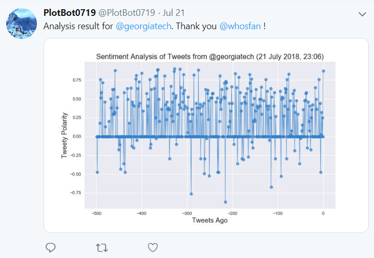

# Plotbot

**[@Plotbot0719](https://twitter.com/PlotBot0719)** is a Twitter bot that sends out visualized sentiment analysis of a Twitter account's recent tweets.

The bot receives tweets via mentions and in turn performs sentiment analysis on the twitter account specified in the mention within 5 minutes.

For example, when a user tweets, **"@PlotBot Analyze: @CNN,"** it will trigger a sentiment analysis on the CNN twitter feed.

**Language**: Python

**Libraries**: [tweepy](http://www.tweepy.org/), [vaderSentiment](https://github.com/cjhutto/vaderSentiment), pandas, matplotlib, numpy

**Deployed on** Heroku

**Notebook**: [Jupyter Notebook](PlotBot0719.ipynb)

A plot from the sentiment analysis is then tweeted to the Plotbot twitter feed. Examples of scatter plots generated:

